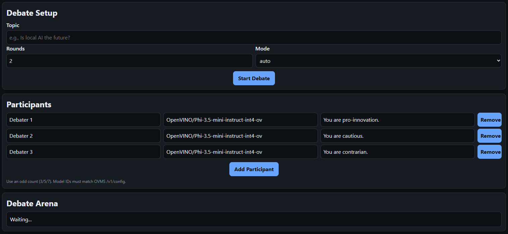

# Debate Arena

Minimal local debate orchestrator that fronts OVMS (OpenVINO Model Server) via its OpenAI-compatible `/v3/chat/completions` endpoint and serves a lightweight UI.



## Architecture
```
+------------+           +-----------------------+           +------------------------------+
|  Browser   |  HTTP     | FastAPI app (/ui, API)|  HTTP     | OVMS OpenAI REST endpoint    |
|  UI (SPA)  |<--------->| - Orchestrator        |<--------->| /v3/chat/completions         |
|            |           | - In-memory store     |           | (models on local OVMS)       |
+------------+           +-----------------------+           +------------------------------+
```
- UI is static HTML/JS served from `/ui` on the FastAPI app.
- Orchestrator coordinates debate templates/runs and fans out chat calls to OVMS via `httpx`.
- In-memory store holds templates/runs/finals (non-persistent).

## Prerequisites
- Python 3.12 (or compatible)
- OVMS running locally with an OpenAI-style chat endpoint at `http://127.0.0.1:8000/v3/chat/completions`
- LLM models in OpenVINO format (e.g., from [HuggingFace OpenVINO org](https://huggingface.co/OpenVINO))

### OVMS Setup & Configuration

OVMS supports two deployment approaches for LLM models:

#### Option 1: Multi-Model Config (Recommended for multiple models)

Create a `models.json` file in your OVMS models directory:

```json
{
  "model_config_list": [
    {
      "config": {
        "name": "phi35-mini",
        "base_path": "./OpenVINO/Phi-3.5-mini-instruct-int4-ov",
        "target_device": "GPU",
        "nireq": 2,
        "allow_cache": true,
        "plugin_config": {
          "PERFORMANCE_HINT": "LATENCY",
          "INFERENCE_PRECISION_HINT": "f16"
        }
      }
    },
    {
      "config": {
        "name": "qwen2.5-7b",
        "base_path": "./OpenVINO/Qwen2.5-7B-Instruct-int4-ov",
        "target_device": "GPU",
        "nireq": 2,
        "allow_cache": true,
        "plugin_config": {
          "PERFORMANCE_HINT": "LATENCY",
          "INFERENCE_PRECISION_HINT": "f16"
        }
      }
    }
  ]
}
```

Start OVMS:
```powershell
cd C:\path\to\ovms
.\ovms.exe --config_path models\models.json --rest_port 8000 --rest_bind_address 127.0.0.1 --log_level ERROR
```

**In the UI, use the model `name` from config** (e.g., `phi35-mini`, `qwen2.5-7b`).

#### Option 2: Single Model Deployment

```powershell
.\ovms.exe --model_path C:\path\to\models\OpenVINO\Phi-3.5-mini-instruct-int4-ov --rest_port 8000 --rest_bind_address 127.0.0.1 --target_device GPU --cache_size 2
```

**In the UI, use the full path** (e.g., `OpenVINO/Phi-3.5-mini-instruct-int4-ov`).

### Important Gotchas

⚠️ **Model Naming**
- **Config-based deployment**: Use the `name` field from your config (e.g., `phi35-mini`)
- **Single model deployment**: Use the full model path (e.g., `OpenVINO/Phi-3.5-mini-instruct-int4-ov`)
- **Wrong model name = 404 error**: "Mediapipe graph definition with requested name is not found"

⚠️ **OVMS Endpoint**
- OVMS LLM endpoint is `/v3/chat/completions` (not `/v1/`)
- Default: `http://127.0.0.1:8000/v3/chat/completions`

⚠️ **Environment Variables**
- `OVMS_BASE_URL` and `MAX_TOKENS` are read at **backend startup**
- Changes require restarting `start.ps1` (not picked up during runtime)

⚠️ **Version Directory Warnings**
- Warnings like "No version found for model" are **harmless** for LLM models
- Use `--log_level ERROR` to suppress them

#### Health check
```bash
curl -X POST http://127.0.0.1:8000/v3/chat/completions \ 
  -H "Content-Type: application/json" \ 
  -d '{"model":"phi35-mini","max_tokens":30,"temperature":0,"stream":false,"messages":[{"role":"system","content":"You are a helpful assistant."},{"role":"user","content":"Say hi"}]}'
```

## Setup

### 1. Backend
```
cd backend
python -m venv .venv
# PowerShell
. .venv/Scripts/Activate.ps1
pip install -r requirements.txt
```

### 2. Configuration (optional)
Copy `.env.example` to `.env` and adjust as needed:
```
OVMS_BASE_URL=http://127.0.0.1:8000
MAX_TOKENS=256
```

## Run

### Quick start (PowerShell)
From repo root:
```
pwsh ./start.ps1
```
Defaults: host `127.0.0.1`, port `8001`, `OVMS_BASE_URL=http://127.0.0.1:8000`. Override as needed:
```
pwsh ./start.ps1 -Host 0.0.0.0 -Port 8001 -OvmsBaseUrl http://localhost:8000
```

### Manual (within backend dir)
```
$env:OVMS_BASE_URL="http://127.0.0.1:8000"
uvicorn app:app --port 8001 --reload
```

Open the UI at: http://127.0.0.1:8001/ui/

## Usage
- Fill in topic, rounds, mode (auto or step), and participants (odd count).
- **Model names must match OVMS configuration:**
  - Auto mode: UI polls and renders as phases complete.
  - Step mode: UI auto-advances phases to stream updates as they finish.
- Debate Arena panel shows chat-style outputs per participant/phase and final outcome.

## Notes
- Storage is in-memory; restarting the app clears templates/runs.
- Final records are still recorded server-side for API access, but the UI focuses on live debate output.
- Frontend automatically detects API base URL (works with any host/port).
- Environment variables (`OVMS_BASE_URL`, `MAX_TOKENS`) are loaded at backend startup - restart required for changes.
